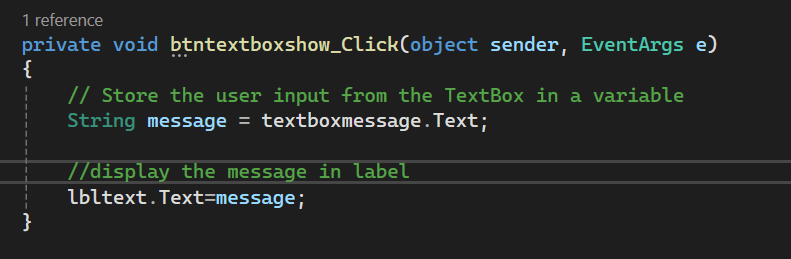
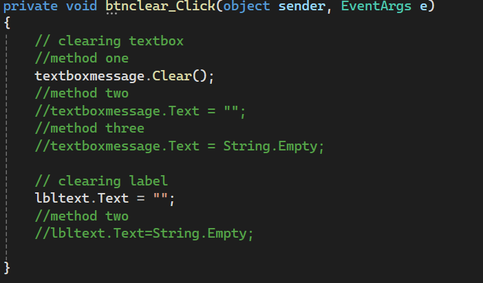
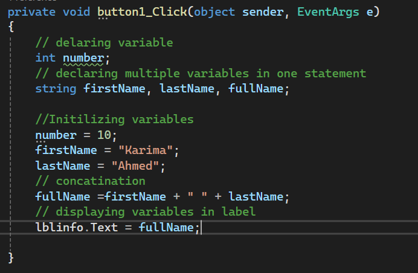
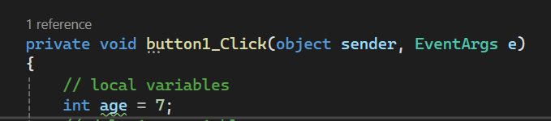
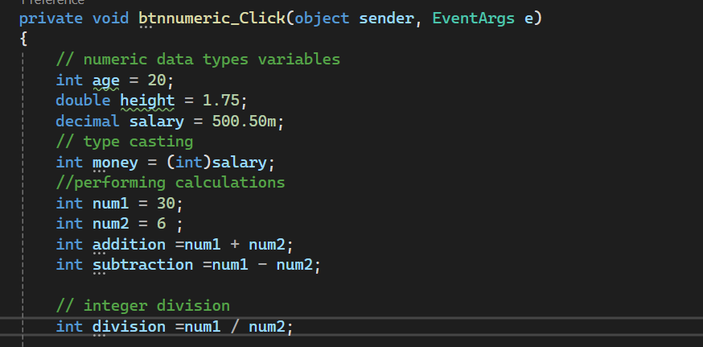
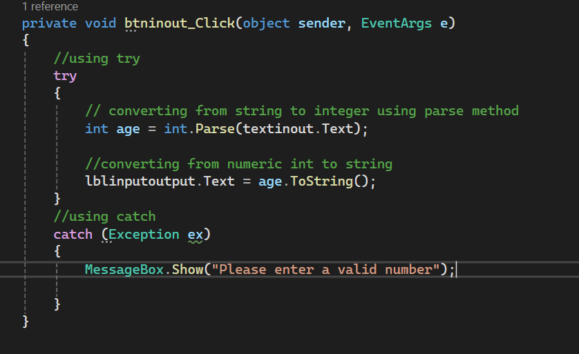
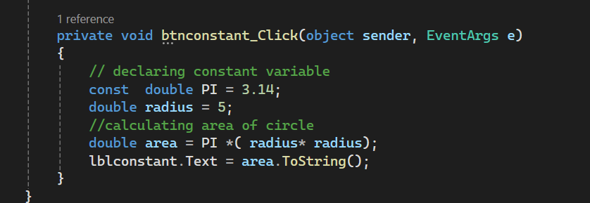

# Chapter 2: Processing Data

**Course:** C# Practice\
**Book:** Starting Out with Visual C# (6th Edition) by Tony Gaddis

------------------------------------------------------------------------

## 1. Reading Input with TextBox Controls

A `TextBox` allows the user to enter data using the keyboard. The input
is stored in the `Text` property and is treated as a string.

``


To clear a TextBox, use any of these statements:

``` csharp
textBox1.Text = "";
textBox1.Text = string.Empty;
textBox1.Clear();

```

## 2. Variables

A variable is a storage location in memory used to store data. A
variable must be declared before it can be used.

**Syntax:**

``` csharp
DataType variableName;


```

## 3. Data Types

A data type specifies what kind of data a variable can store.

-   `string`: stores text and characters.
-   `int`: stores whole numbers.
-   `double`: stores numbers with fractional parts.
-   `decimal`: stores decimal numbers with greater precision, commonly
    used for financial values.

Primitive data types are basic, built-in types provided by the
programming language.

## 4. Variable Naming Rules

A variable name: - Must begin with a letter or underscore (`_`). -
Cannot contain spaces. - Should have a meaningful name. - Cannot be a C#
keyword or reserved word.

## 5. String Variables

A string stores a combination of characters, such as names, phone
numbers, and other text.

Example:

``` csharp
string universityName = "Jamhuuriya University";
```

## 6. String Concatenation

Concatenation means joining strings together. The `+` operator is used
to join strings.

Example:

``` csharp
string fullName = firstNameTextBox.Text + " " + lastNameTextBox.Text;
fullNameLabel.Text = fullName;
```

This joins the first name, a space, and the last name, then displays the
result in a Label.

## 7. Local Variables, Scope, and Lifetime

A **local variable** is declared inside a method and can only be
accessed within that method.

-   **Scope:** the part of a program where a variable can be accessed.
-   **Lifetime:** the period during which a variable exists in memory
    while the program is running.



## 8. Variable Initialization and Assignment Compatibility

**Initialization** means assigning a value to a variable. A variable
must be assigned a value before it is used.

**Assignment compatibility** means that a value can only be assigned to
a variable when the value is compatible with the variable's data type.

You can declare multiple variables of the same data type in one
statement:

``` csharp
string lastName, firstName, middleName;
```

## 9. Numeric Data Types and Variables

Numeric data types are used when a program needs to store numbers and
perform calculations.

  -----------------------------------------------------------------------
  Data Type                           Description
  ----------------------------------- -----------------------------------
  `int`                               Stores whole numbers

  `double`                            Stores numbers with decimal or
                                      fractional parts

  `decimal`                           Stores decimal numbers with greater
                                      precision, commonly used for
                                      financial values
  -----------------------------------------------------------------------

## 10. Numeric Literals

A numeric literal is a number written directly in the program.

``` csharp
int hoursWorked = 40;
double temperature = 87.6;
decimal payRate = 28.75m;

```

The `m` or `M` suffix identifies a decimal literal.


## 11. Type Casting and the `var` Keyword

**Type casting** is explicitly converting a value from one data type to
another.

``` csharp
decimal moneyNumber = 4500m;
int wholeNumber = (int)moneyNumber;
```

The `var` keyword allows C# to determine the variable's data type from
the value assigned to it. A variable declared with `var` must be
initialized.

``` csharp
var interestRate = 12.0;
var stockCode = "D465U";
```

## 12. Performing Calculations

C# uses arithmetic operators to perform mathematical calculations.

  Operator   Meaning
  ---------- ---------------------
  `+`        Addition
  `-`        Subtraction
  `*`        Multiplication
  `/`        Division
  `%`        Modulus (remainder)

Follow the order of operations and use parentheses when needed.

**Integer division:** When two integers are divided, the result is an
integer. To get a fractional result, convert one value to `double`.

## 13. Inputting and Outputting Numeric Values

TextBox input is always treated as a string, even when the user enters a
number. Convert it to a numeric type before performing calculations.

Common conversion methods:

``` csharp
int hoursWorked = int.Parse(hoursWorkedTextBox.Text);
double temperature = double.Parse(temperatureTextBox.Text);
decimal payRate = decimal.Parse(payRateTextBox.Text);
```

To display a numeric value in a Label or TextBox, convert it to a string
using `ToString()`.

``` csharp
grossPayLabel.Text = grossPay.ToString();
```

## 14. Formatting Numbers with `ToString()`

The `ToString()` method can format numbers in different ways.

  Format   Purpose
  -------- --------------------
  `"N"`    Number format
  `"F"`    Fixed-point format
  `"E"`    Exponential format
  `"C"`    Currency format
  `"P"`    Percentage format

Example:

``` csharp
grossPayLabel.Text = grossPay.ToString("c");
```

## 15. Exception Handling with `try-catch`

An **exception** is an unexpected error that occurs while a program is
running. Examples include invalid user input and dividing by zero.

The `try` block contains code that might cause an exception. The `catch`
block handles the exception.

``` csharp
try
{
    double miles = double.Parse(milesTextBox.Text);
    double gallons = double.Parse(gallonsTextBox.Text);
    double mpg = miles / gallons;

    mpgLabel.Text = mpg.ToString();
}
catch (Exception ex)
{
    MessageBox.Show(ex.Message);
}

```

## 16. Named Constants

A named constant represents a value that cannot be changed during
program execution. The `const` keyword is used to declare a constant.

``` csharp
const double INTEREST_RATE = 0.129;

```

## 17. Declaring Variables as Fields

A **field** is a variable declared inside a class but outside of any
method. A field's scope is the class, subject to its access rules.

## 18. Using the Math Class

The .NET `Math` class provides methods for mathematical calculations.

-   `Math.Sqrt(x)`: returns the square root of `x`.
-   `Math.Pow(x, y)`: returns `x` raised to the power of `y`.
-   `Math.Max(x, y)`: returns the greater of two values.
-   `Math.Min(x, y)`: returns the lesser of two values.
-   `Math.Round(x)`: rounds a value to the nearest integer.
-   `Math.PI`: represents pi.
-   `Math.E`: represents the natural logarithmic base.

## 19. More GUI Details

-   **Tab order:** the order in which controls receive keyboard focus.
-   **Focus:** a control receives keyboard input when it has focus. Use
    `ControlName.Focus()` to move focus.
-   **Access keys:** adding `&` before a letter in a button's Text
    property creates an Alt-key shortcut.
-   **Colors:** `BackColor` sets the background color and `ForeColor`
    sets the text color.
-   **Background images:** `BackgroundImage` and `BackgroundImageLayout`
    control a form's background image.
-   **GroupBox and Panel:** both can contain other controls. A GroupBox
    can display a title; a Panel cannot.

## 20. Debugging Logic Errors

A **logic error** is a mistake that allows an application to run but
causes an incorrect result.

-   **Breakpoint:** pauses execution at a selected line.
-   **Break mode:** allows you to examine variable values and control
    properties.
-   **Locals window:** displays local variables and their current
    values.
-   **Watch window:** displays variables selected for monitoring.
-   **Single-stepping:** executes code one statement at a time. Press
    `F11` or use **Step Into**.

------------------------------------------------------------------------

## Summary

  -----------------------------------------------------------------------
  Topic                               Main Idea
  ----------------------------------- -----------------------------------
  TextBox controls                    Receive user input as strings

  Variables and data types            Store different kinds of data

  Concatenation                       Joins strings using `+`

  Numeric data and calculations       Store numbers and perform
                                      arithmetic

  `Parse()` and `ToString()`          Convert input and prepare values
                                      for display

  Number formatting                   Displays values as numbers,
                                      currency, percentages, and more

  `try-catch`                         Responds to runtime exceptions

  Constants and fields                Store fixed values and class-level
                                      data

  Math class                          Provides mathematical methods and
                                      constants

  GUI details                         Configure focus, colors, shortcuts,
                                      and containers

  Debugging                           Helps locate logic errors
  -----------------------------------------------------------------------
